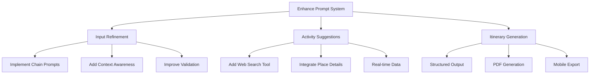

# AI Travel Planner Enhancement Plan

## Overview
Based on the analysis of the current implementation, several key improvements are needed to meet the assignment requirements and enhance user experience.

## System Architecture

## Detailed Implementation Plan

### 1. Enhanced Prompt System (3-4 hours)
- Create a sophisticated prompt chain system in GeminiAPI
  - Input refinement prompts
  - Activity suggestion prompts
  - Itinerary generation prompts
- Implement conversation memory for context retention
- Add validation and error handling
- Enhance personalization based on user preferences

### 2. Web Search Integration (2-3 hours)
- Create WebSearchAPI class
  - Integrate with travel APIs (TripAdvisor, Google Places)
  - Implement caching system
  - Add rate limiting and error handling
- Real-time data fetching
  - Attraction details
  - Current prices
  - Opening hours
  - Reviews and ratings

### 3. UI/UX Improvements (2 hours)
- Add progress indicators
  - Prompt chain status
  - Data loading states
- Implement auto-save functionality
- Enhance error messaging
- Improve mobile responsiveness
- Add user preference persistence

### 4. Output Generation (1-2 hours)
- Implement PDF generation using reportlab
  - Professional formatting
  - Maps integration
  - QR codes for locations
- Add multiple export formats
  - PDF download
  - JSON export
  - Mobile-friendly format
- Include visual elements
  - Location photos
  - Weather icons
  - Activity timelines

### 5. Testing & Documentation (<1 hour)
- Add unit tests
  - Core functionality testing
  - API integration tests
  - UI component tests
- Implement error logging
- Create documentation
  - User guide
  - API documentation
  - Development setup guide

## Timeline
Total estimated time: 9-12 hours
- Prompt System Enhancement: 3-4 hours
- Web Search Integration: 2-3 hours
- UI/UX Improvements: 2 hours
- Output Generation: 1-2 hours
- Testing & Documentation: <1 hour